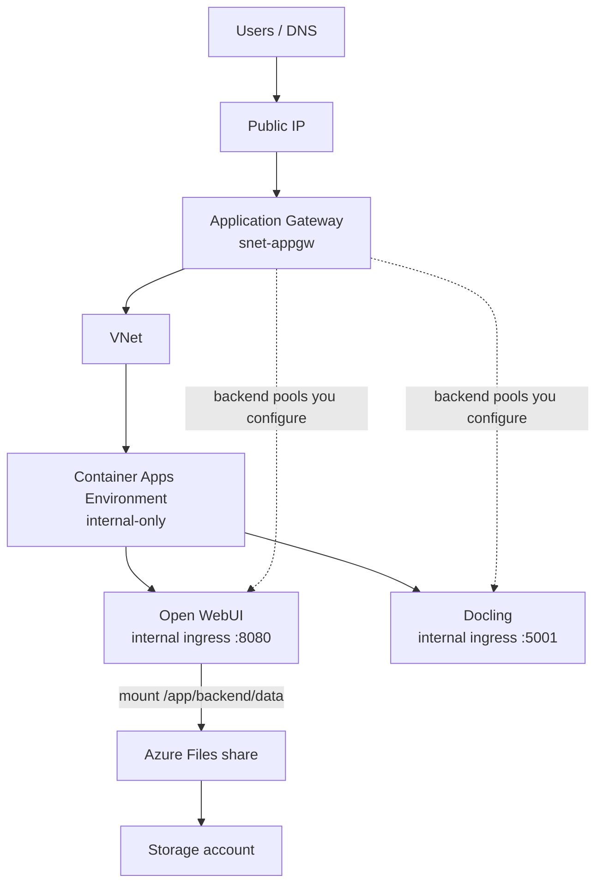

# AIKT DevOps — Azure deployment scripts

Bash scripts to deploy a GenAI stack on Azure: **Application Gateway** as the sole public entry point, **internal Container Apps** (Open WebUI + Docling), and **Azure Files** for Open WebUI persistence.

All scripts read settings from [`config.yaml`](config.yaml) at the repo root. Copy [`config.example.yaml`](config.example.yaml) to get started.

## Architecture



| Component | Access | Notes |
|-----------|--------|--------|
| Application Gateway | Public (only public entry) | Standard_v2, in dedicated subnet |
| Container Apps | Internal only | No public ingress; VNet-integrated CAE |
| Open WebUI | Via App Gateway | Azure Files mount for persistent data |
| Docling | Via App Gateway | Stateless |
| Storage account | Used by CAE mount | SMB share; `nobrl` required for SQLite |

Traffic flow: **Internet → App Gateway public IP → internal app FQDNs (inside VNet) → containers**. Container apps are not reachable directly from the internet.

## Prerequisites

- [Azure CLI](https://learn.microsoft.com/en-us/cli/azure/install-azure-cli) (`az`), logged in
- Container Apps extension: `az extension add --name containerapp --upgrade`
- Bash (Git Bash or WSL on Windows)
- Optional: [yq](https://github.com/mikefarah/yq) — otherwise Python 3 + PyYAML (`pip install pyyaml`)

## Configuration

Edit `config.yaml` before deploying.

### Subscriptions and project

```yaml
subscriptions:
  example:
    tenant_id: "..."
    subscription_id: "..."

project:
  client: "test"        # used in resource naming
  rg: "rg-test"         # resource group name (literal)
  location: westeurope
```

Use `--profile <name>` to pick a subscription when multiple are defined, or set `defaults.profile` in config.

### Resource naming

Most `resources.*.name` values are **local short names**. Scripts expand them to:

**`{local}-{client}-{location-suffix}`**

| Local | Client | Location | Result |
|-------|--------|----------|--------|
| `vnet` | `test` | `westeurope` | `vnet-test-westeu` |
| `cae` | `test` | `westeurope` | `cae-test-westeu` |
| `appgateway` | `test` | `westeurope` | `appgateway-test-westeu` |

Location suffix: `westeurope` → `westeu`, `northeurope` → `northeu`.

**Exception:** storage account names are alphanumeric only (no hyphens), e.g. `staccount` + `test` + `westeu` → `staccounttestwesteu`.

The resource group name comes from `project.rg` as written (not auto-suffixed).

### Network

```yaml
resources:
  vnet:
    name: "vnet"
    address-prefix: "10.0.0.0/16"
    subnets:
      app-gateway:
        name: "snet-appgw"
        prefix: "10.0.1.0/24"    # App Gateway only
      container-apps:
        name: "snet-cae"
        prefix: "10.0.2.0/23"    # CAE infrastructure (/23 minimum)
```

Subnets must not overlap. The CAE subnet is delegated to `Microsoft.App/environments`.

### Storage (Open WebUI)

```yaml
  storage-account:
    name: "staccount"
    replication: "LRS"
    kind: "StorageV2"
    volume:
      name: "volsmb"              # CAE storage link name
      fileshare: "afssmb"         # Azure Files share name
      mount-path: "/app/backend/data"
      mount-options: "nobrl"      # required for SQLite on Azure Files
```

## Deployment order

Scripts enforce dependencies. Run in this order:

```bash
./Resource_Group/create_rg.sh
./Network/create_vnet.sh
./Storage/create_storage.sh
./Apps/create_apps.sh
./Gateway/create_gateway.sh
```

Then configure App Gateway listeners, HTTPS, and backend pools manually (see below).

All scripts accept optional flags:

```bash
--profile <config-profile>
--resource-group <rg>    # or -g
--location <region>
```

Example:

```bash
./Network/create_vnet.sh --profile example
```

## Scripts reference

### Resource group

| Script | Purpose |
|--------|---------|
| `Resource_Group/create_rg.sh` | Creates the resource group |
| `Resource_Group/delete_rg.sh` | Deletes the resource group (and everything in it) |

### Network

| Script | Purpose | Requires |
|--------|---------|----------|
| `Network/create_vnet.sh` | VNet + App Gateway subnet + CAE subnet | Resource group |

### Storage

| Script | Purpose | Requires |
|--------|---------|----------|
| `Storage/create_storage.sh` | Storage account + Azure Files share | Resource group |

### Container apps

| Script | Purpose | Requires |
|--------|---------|----------|
| `Apps/create_apps.sh` | Internal CAE, Docling, Open WebUI (with file mount) | VNet/CAE subnet, storage |
| `Apps/delete_apps.sh` | Removes apps and CAE | — |

**`create_apps.sh` does:**

1. Creates an **internal-only** Container Apps environment in the CAE subnet
2. Deploys Docling with **internal ingress** on port 5001
3. Links the Azure Files share to the environment
4. Deploys Open WebUI with **internal ingress** on port 8080 and persistent volume at `/app/backend/data`

On completion it prints **internal FQDNs** — use these as App Gateway backend targets.

### Application Gateway

| Script | Purpose | Requires |
|--------|---------|----------|
| `Gateway/create_gateway.sh` | Standard_v2 gateway + public IP | VNet, App Gateway subnet |

HTTPS, listeners, routing rules, and backend pools are **not** automated. Configure those in the Azure portal or via CLI after the gateway exists.

### DNS (optional)

| Script | Purpose |
|--------|---------|
| `DNS/txt_challenge.sh` | Let's Encrypt manual DNS challenge (certbot) |
| `DNS/azure_dns_upsert.sh` | Upsert ACME TXT record in Azure DNS |

Use these when obtaining a TLS certificate for App Gateway.

## Application Gateway setup

After `create_gateway.sh`, wire the gateway to your apps:

1. Note the **public IP** printed at the end of `create_gateway.sh`
2. Point your DNS A record at that IP
3. Upload your TLS certificate (PFX) if using HTTPS
4. Create **backend pools** using the internal FQDNs from `create_apps.sh`:

   | App | Typical port |
   |-----|----------------|
   | Open WebUI | 8080 |
   | Docling | 5001 |

5. Add HTTP settings, health probes, listeners, and routing rules

App Gateway and the container apps must be in the **same VNet**. If the gateway cannot resolve internal FQDNs, link a private DNS zone for the Container Apps domain to the VNet ([Microsoft guidance](https://learn.microsoft.com/en-us/azure/container-apps/waf-app-gateway)).

If you use NSGs, allow traffic from the **App Gateway subnet** to the **CAE subnet** on ports 8080 and 5001.

## Teardown

Delete in reverse order, or remove the whole resource group:

```bash
./Apps/delete_apps.sh --yes
# ... other delete scripts as added ...
./Resource_Group/delete_rg.sh --yes   # removes everything in the RG
```

**Warning:** `delete_rg.sh` permanently deletes all resources in the group.

## Idempotency

Scripts skip resources that already exist where possible. Exceptions:

- **CAE internal vs public** is fixed at creation time — you cannot switch an existing environment from public to internal; delete and recreate.
- **Open WebUI without a volume** — if the app was created before the file mount was added, delete it and re-run `create_apps.sh`.

## Project layout

```
DevOps/
├── config.yaml              # your settings (not committed if sensitive)
├── config.example.yaml
├── Resource_Group/
├── Network/
├── Storage/
├── Apps/
├── Gateway/
└── DNS/
```

Shared helpers live in `*_lib_*.sh` files; deployment scripts source these automatically.
