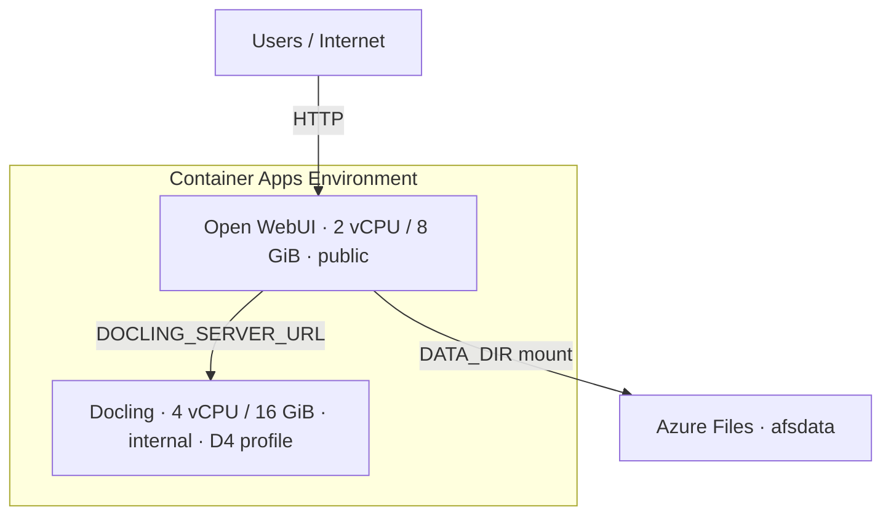

# AIKT DevOps — Azure Container Apps deployment

Bash scripts to deploy **Open WebUI** and **Docling** on **Azure Container Apps**, with **Azure Files** for Open WebUI persistence (users, chats, SQLite, uploads, vectors). Azure File mounts use `mountOptions: nobrl` so SQLite works on SMB.

All scripts read [`config.yaml`](config.yaml). Copy [`config.example.yaml`](config.example.yaml) to get started.

## Architecture



| Component | Spec | Access |
|-----------|------|--------|
| Open WebUI | 2 CPU, 8 GiB (Consumption) | Public HTTPS/HTTP FQDN |
| Docling | 4 CPU, 16 GiB (D4 workload profile) | Internal ingress only |
| Storage | Azure Files at `/app/backend/data` (`nobrl` mount for SQLite) | Full persistence |

## Prerequisites

- [Azure CLI](https://learn.microsoft.com/en-us/cli/azure/install-azure-cli) + `containerapp` extension (installed automatically)
- `yq` or Python 3 with PyYAML
- `openssl` (for `WEBUI_SECRET_KEY`)

## Deployment

### Fresh start (delete existing stack)

From Git Bash in the repo root:

```bash
# 1. Delete the whole resource group (async)
./Resource_Group/delete_rg.sh --yes

# 2. Wait until Azure finishes deleting it
az group wait --deleted -n rg-test

# 3. Deploy in order
./Resource_Group/create_rg.sh
./Network/create_vnet.sh
./Storage/create_storage.sh
./Apps/create_apps.sh
```

Replace `rg-test` with your `project.rg` from `config.yaml`.

### Try another region

Edit `project.location` in `config.yaml` (or pass `--location`), then re-run the scripts. Container Apps and D4 profiles are not available in every region — check [Azure products by region](https://azure.microsoft.com/explore/global-infrastructure/products-by-region/).

## Configuration

```yaml
  container-apps:
    apps:
      openwebui:
        cpu: 2
        memory: 8Gi
      docling:
        cpu: 4
        memory: 16Gi
        workload-profile: D4   # required for 16 GiB
  storage-account:
    volume:
      mount-path: "/app/backend/data"
```

## Teardown

```bash
./Apps/delete_apps.sh --yes
./Resource_Group/delete_rg.sh --yes
```


